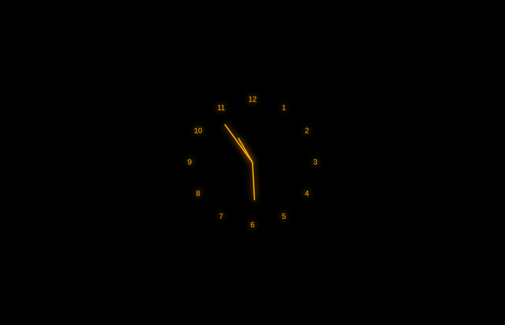

# Analog Clock

A real-time analog clock built using HTML5 Canvas, CSS, and JavaScript. Click anywhere on the canvas to toggle between dark and light modes.

## Features
- Live clock hands for hours, minutes, and seconds
- Responsive canvas that fills the screen
- Dark/Light mode toggle on click
- Smooth animation using `requestAnimationFrame`

## How to Run
Just open `index.html` in a browser. No setup required.

## Preview

